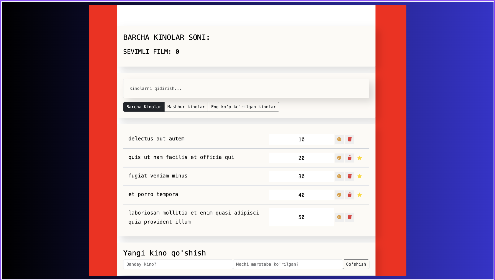

# movies-project
# 🎬 Movies App — React State Management Project

## Screenshot



A movie management application built with React, focused on mastering state management with `useContext` and `useReducer`. This project was built as a hands-on exercise after completing lessons on React hooks, API integration, and global state management.


## Table of Contents

- [Overview](#overview)
  - [The Challenge](#the-challenge)
  - [Features](#features)
- [My Process](#my-process)
  - [Built With](#built-with)
  - [What I Learned](#what-i-learned)
  - [Continued Development](#continued-development)
  - [AI Collaboration](#ai-collaboration)
- [Author](#author)

---

## Overview

### The Challenge

Users should be able to:

- View a list of movies fetched from an external API
- Search movies by name in real time
- Filter movies by category: All, Popular, and Most Viewed
- Add new movies using a form
- Delete movies from the list
- Toggle movie properties (favourite, like)

### Features

- Global state management with `useContext` + `useReducer`
- Real-time search and filter
- API data fetching with `useEffect`
- Modular component structure
- Utility functions extracted into a separate module

---

## My Process

### Built With

- React 18
- `useContext` + `useReducer` for global state
- `useEffect` for API calls
- `useState` for local UI state
- `uuid` for unique IDs
- JSONPlaceholder API
- CSS / Bootstrap utility classes

---

### What I Learned

**1. useReducer — centralized state logic**

Instead of multiple `useState` calls scattered across components, `useReducer` puts all state transitions in one place:

```jsx
const reducer = (state, action) => {
  switch (action.type) {
    case 'GET_DATA':
      return { ...state, data: action.payload }
    case 'ON_DELETE': {
      const filtered = state.data.filter(c => c.id !== action.payload)
      return { ...state, data: filtered }
    }
    case 'ON_TOGGLE_PROP': {
      const { id, prop } = action.payload
      const toggled = state.data.map(item =>
        item.id === id ? { ...item, [prop]: !item[prop] } : item
      )
      return { ...state, data: toggled }
    }
    default:
      return state  // ⚠️ return state, NOT {state}
  }
}
```

**2. Context API — sharing state without prop drilling**

Wrapping the entire app in a Provider makes `state` and `dispatch` available anywhere:

```jsx
const Provider = ({ children }) => {
  const [state, dispatch] = useReducer(reducer, initialValue)
  return (
    <Context.Provider value={{ state, dispatch }}>
      {children}
    </Context.Provider>
  )
}
```

**3. useContext — consuming global state in any component**

```jsx
const { state, dispatch } = useContext(Context)
```

No more passing props 3 levels deep — any component can read or update the global state directly.

**4. dispatch — the only way to update state**

Instead of `setState`, every update goes through `dispatch`:

```jsx
// Delete a movie
dispatch({ type: 'ON_DELETE', payload: id })

// Add a movie
dispatch({ type: 'ADD_FORM', payload: { name, viewers } })

// Update search term
dispatch({ type: 'ON_TERM', payload: term })

// Update filter
dispatch({ type: 'ON_FILTER', payload: filter })
```

**5. Extracting utility functions into a separate module**

Search and filter logic was moved out of components into `utilities/data.js`:

```js
export const searchHandler = (arr, term) => {
  if (term.length === 0) return arr
  return arr.filter(item => item.name.toLowerCase().includes(term))
}

export const filterHandler = (arr, filter) => {
  switch (filter) {
    case 'popular':    return arr.filter(c => c.like)
    case 'mostViewers': return arr.filter(c => c.viewers > 800)
    default:            return arr
  }
}
```

This keeps components clean and makes the logic reusable and testable.

**6. Combining search and filter**

Both are applied in a single expression inside `MovieList`:

```jsx
const data = filterHandler(searchHandler(state.data, state.term), state.filter)
```

**7. useEffect for API fetching**

```jsx
useEffect(() => {
  fetch('https://jsonplaceholder.typicode.com/todos?_limit=5')
    .then(res => res.json())
    .then(json => {
      const formatted = json.map(item => ({
        name: item.title,
        id: item.id,
        viewers: item.id * 10,
        favourite: false,
        like: false,
      }))
      dispatch({ type: 'GET_DATA', payload: formatted })
    })
    .catch(err => console.log(err))
}, [])
```

**8. switch/case with const — requires block scope**

When using `const` inside a `case`, it must be wrapped in curly braces `{}` to avoid scope conflicts:

```jsx
// ❌ Error — const bleeds between cases
case 'ON_DELETE':
  const arr = ...

// ✅ Correct — block scope isolates the variable
case 'ON_DELETE': {
  const arr = ...
  return ...
}
```

**9. The {state} vs state mistake**

A subtle but critical bug: `return {state}` wraps state in an extra object, making `state.data` undefined:

```jsx
// ❌ Bug — creates { state: { data, term, filter } }
default: return {state}

// ✅ Correct — returns the state object as-is
default: return state
```

---

### Continued Development

- TypeScript for type safety across reducers and components
- React Router for multi-page navigation
- Custom hooks to further abstract logic
- Unit testing with React Testing Library
- Performance optimization with `useMemo` and `useCallback`

---

### AI Collaboration

- **Tool:** Claude (Anthropic)
- **How:** Used occasionally to double-check concepts like `useReducer` and `Context` API while building the project independently
- **What worked well:** Helpful for quickly looking up syntax when stuck — similar to using documentation or Stack Overflow
- **What didn't:** For real understanding, actually writing and breaking the code yourself is irreplaceable — AI explanations alone don't build muscle memory

---

## Author

- GitHub — [@Ismail-SWE](https://github.com/Ismail-SWE)
- Frontend Mentor — [@Ismail-SWE](https://www.frontendmentor.io/profile/Ismail-SWE)